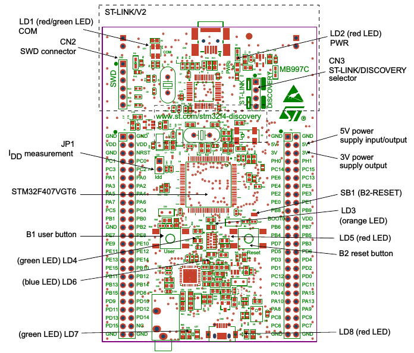

# STM32F4 Configuration

on picture above, fill the Project name, we fill it with "coba1". As we use STM32F4 Discovery board, so we are selecting STM32F4xx C/C++ Project  

Select the correct Chip Family, it's STM32F407xx for Discovery Board!  

directory settings for source code and header file, library source code.  

Remember to download the right Toolchain, extract it and paste the path here.  
Wi need to write something about the toolchain.  

The HSE_Value are asked in header file in startup source code file. here HSE_VALUE are written as an define in compiler option (-D)

the board overlay design are taken from Board datasheet. 

